# Artificial Intelligence for Breast Cancer Detection and Diagnosis

This final thesis aims to study different techniques for detecting and diagnosing breast cancer using Artificial Intelligence algorithms based on **Machine Learning** and **Deep Learning**. Labeled mammography images are used as the data source, processed in various ways depending on the technique applied.

After studying these techniques, the results are compared in order to subsequently choose the best combination of techniques to integrate into a CADx or CADe system.

# Repository Content

This repository contains four folders: 
* **Data** → contains several files in both csv and xls format, used to assign labels to images or to extract a certain subset of images. The images in the dataset can be downloaded here: https://www.kaggle.com/datasets/awsaf49/cbis-ddsm-breast-cancer-image-dataset
* **Code** → The Python code developed for each test performed is collected. Within this, we find folders:
  * **Detection** → contains the codes associated with the detection part of the project.
  * **Diagnosis** → contains the codes associated with the diagnostic part of the project.
  * **Others** → contains other codes that are relevant to the project. Inside that folder, there is a folder called **MIAS**. This folder contains the codes that were used at the beginning of the project to familiarise ourselves with Python functions, as well as obsolete codes that were used in techniques that were discarded for the project. All of these codes were tested with the **MIAS** database, which is smaller than the **CBIS-DDSM** database.
* **Results** → contains the results obtained in each experiment, both in the detection and diagnosis parts. They are very varied. You will be able to see different files, from graphs to .txt files where you can view the execution logs for each test. Specifically for the diagnosis process, there is a results folder that YOLOv5 returns once the training phase is complete, and another after running the testing phase.
* **Resources** → Contains the images for project documentation.

# Used Techniques

The following **Deep Learning** techniques have been used:

- Convolutional Neural Network design with the following architecture:

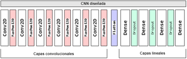

- VGG16 net, which has the following architecture:

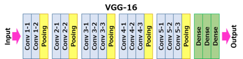

- **YOLOv5** Retraining: The object detection algorithm has been successfully adapted to detect tumours in mammography images. For that purpose, a subset of mammograms extracted from CBIS-DDSM were manually labelled in **YOLOv5** format for subsequent training.
  - Link to **YOLOv5** repository: https://github.com/ultralytics/yolov5
  - **YOLOv5** Retraining tutorial: https://colab.research.google.com/github/roboflow-ai/yolov5-custom-training-tutorial/blob/main/yolov5-custom-training.ipynb#scrollTo=X7yAi9hd-T4B

The following **Machine Learning** techniques have been used:
- *K-Nearest Neighbors (KNN)*
- *Logistic Regression*
- *Support Vector Machine (SVM)*
- *Random Forest*
- *Decision Tree Classifier*
- *Naive Bayes Classifier (GaussianNB)*

# Results

## Detection Results

### CNN designed

*Accuracy* result in test: 0.84

### VGG16 net

*Accuracy* result in test: 0.87

### YOLOv5

#### Confusion Matrix
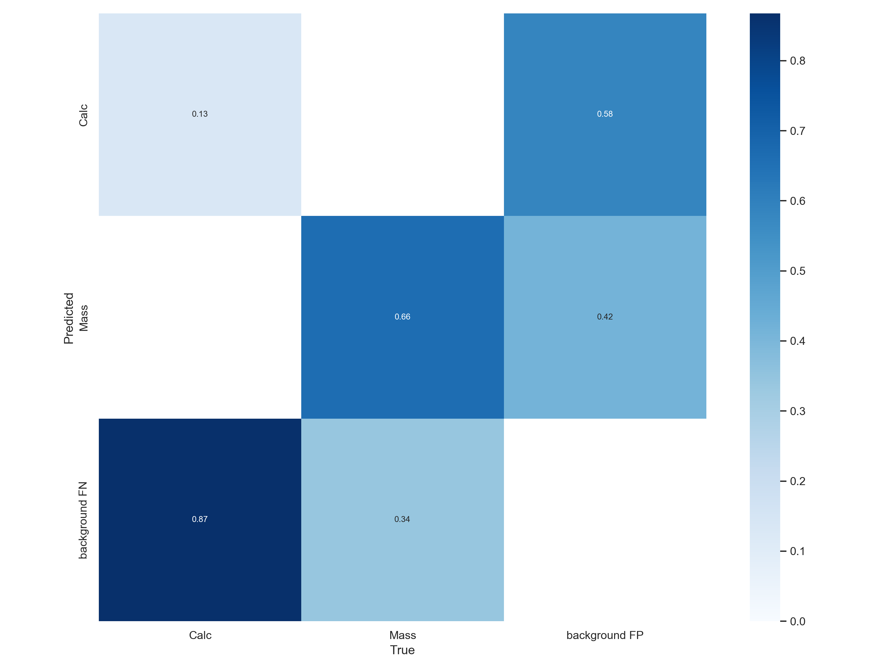

#### Metrics
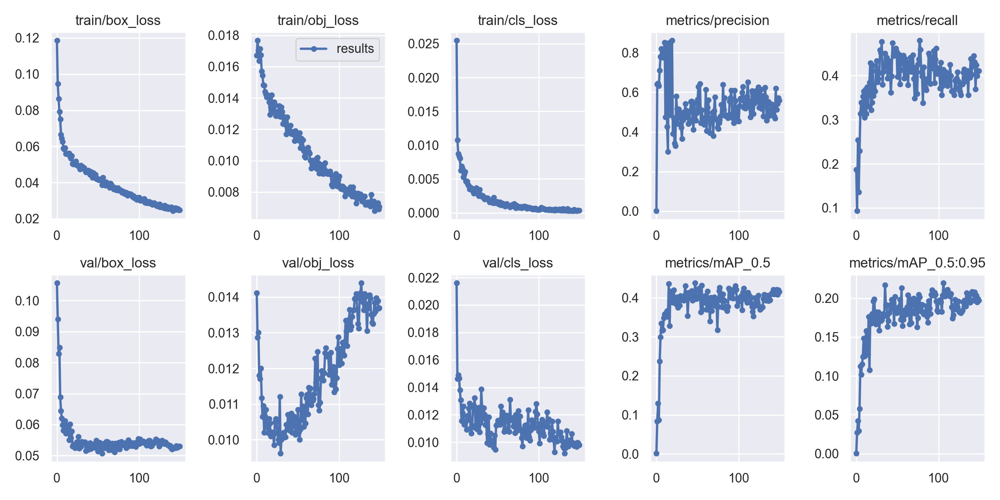

#### Some sample results
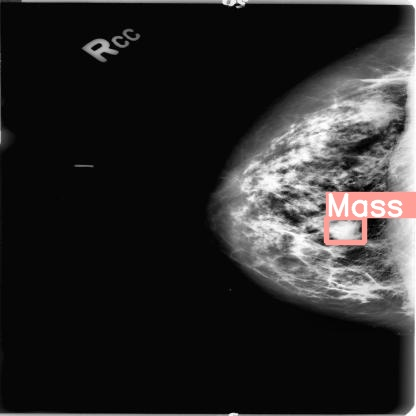
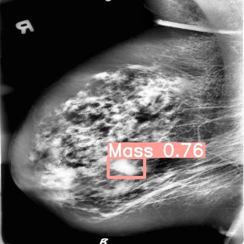
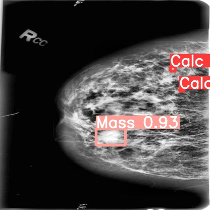
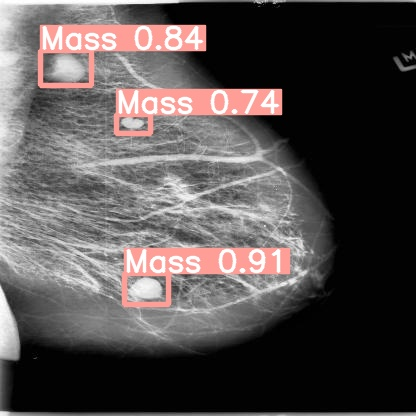
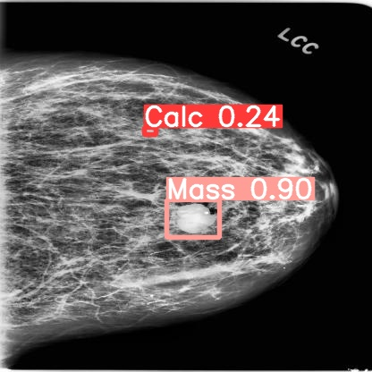
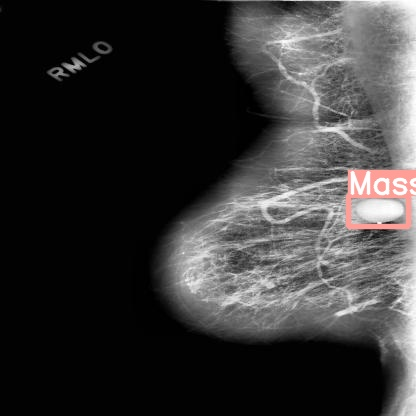

## Diagnosis Results

### Calcifications - CNN designed
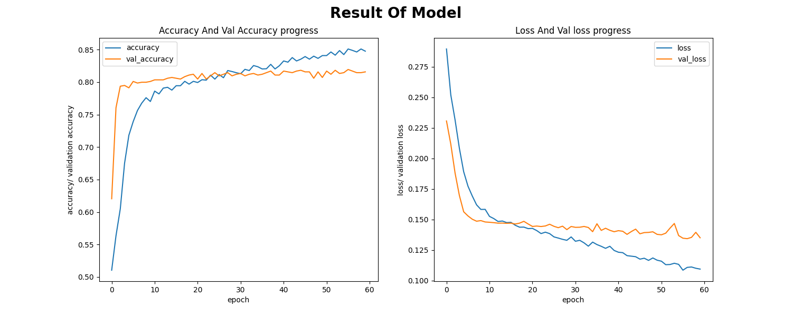

*Accuracy* result in test: 0.6

### Calcifications - VGG16 net
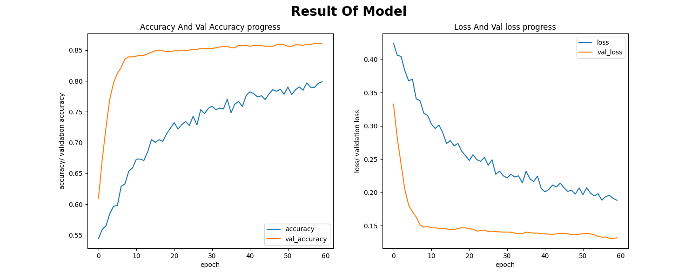

*Accuracy* result in test: 0.57

### Masses - CNN designed
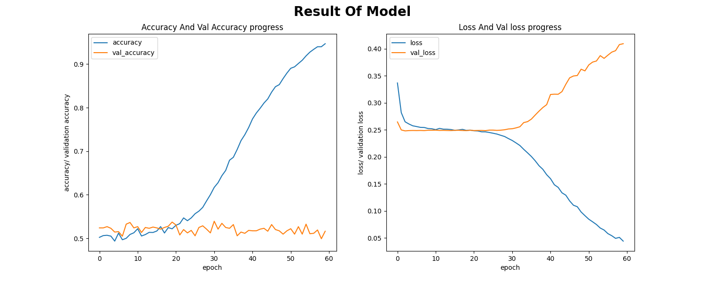

*Accuracy* result in test: 0.54

### Masses VGG16 net
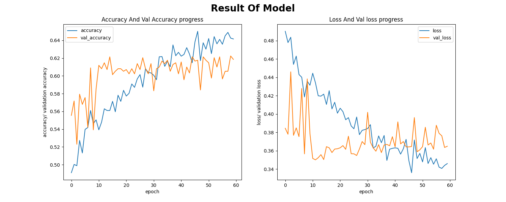

*Accuracy* result in test: 0.62

## Diagnosis results using Machine_Learning_Techniques

Sensitivity Formula:
.png)

Formula Specificity:
.png)

Sensitivity:
| Technique used | feature extraction(%) | feature extraction bounded(%) |
| ------------- | ------------- | ------------- |
| KNN | 36.57 | 37.09 |
| Logistic Regression | 54.24 | 53.56 |
| svc | 55.88 | 55.88 |
| Random Forest  | 44.80 | 45.36 |
| Decision Tree Classifier | 45.60 | 39.66 |
| GaussianNB | 57.68 | 57.39 |

Specificity:
| Technique used | feature extraction(%) | feature extraction bounded(%) |
| ------------- | ------------- | ------------- |
| KNN | 26.04 | 25.86 |
| Logistic Regression | 33.96 | 26.83 |
| svc | 20.21 | 20.21 |
| Random Forest  | 28.29 | 30.13 |
| Decision Tree Classifier | 30.86 | 26.74 |
| GaussianNB | 18.44 | 18.33 |

In both cases a binary classification is performed, so the opposite value can be taken:

Sensitivity:
| Technique used | feature extraction(%) | feature extraction bounded(%) |
| ------------- | ------------- | ------------- |
| KNN | 63.43 | 62.91 |
| Logistic Regression | 45.76 | 46.44 |
| svc | 44.12 | 44.12 |
| Random Forest  | 55.20 |  54.64|
| Decision Tree Classifier | 54.40 | 60.34 |
| GaussianNB | 42.32 | 42.61 |

Specificity:
| Technique used | feature extraction(%) | feature extraction bounded(%) |
| ------------- | ------------- | ------------- |
| KNN | 73.96 | 74.14 |
| Logistic Regression | 66.04 | 73.17 |
| svc | 79.79 | 79.79 |
| Random Forest  | 71.71 | 69.87 |
| Decision Tree Classifier | 69.14 | 73.26 |
| GaussianNB | 81.56 | 81.67 |
